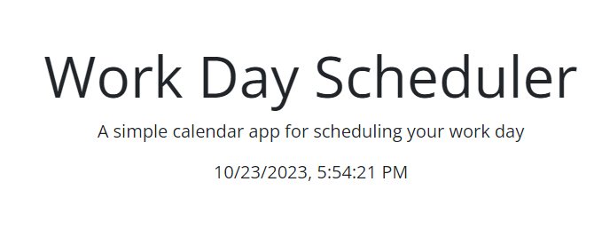

# Work Day Scheduler

The Work Day Scheduler is an application for scheduling tasks throughout the workday. It provides an hourly layout from 9AM to 5PM in which you can enter and save tasks for each hour block. The website is styled with Bootstap and uses dayjs to display and keep track of time.

## Table of Contents

- [Technologies Used](#technologies-used)
- [Features](#features)
- [Functionality](#functionality)
- [Screenshots](#screenshots)
- [Website Link](#website-link)
- [Credits](#credits)

## Technologies Used

- **HTML**: Forms the structure of the scheduling blocks.
- **CSS**: Add styles with responsive designs and color-coded time blocks.
- **JavaScript**: Used to add functionality to the webpage.
- **dayjs**: Used for real-time date and time features.
- **jquery**: Used to simplify and minimize code.
- **Bootstrap**: Framework for css used to style most of the webpage

## Features 

- **Real-Time Feedback**: The color of time blocks change based on the current time to indicate past, present, or future.
- **Intuitive User Interface**: Each hour has its own dedicated input area with a save button.
- **Responsive Design**: Adjusts to different screen sizes ensuring a consistent user experience.
- **Local Storage**: Makes it so tasks remain after a browser refreshes.

## Functionality

- **Real-Time Date & Time Display**: Upon loading, users can immediately see the current date and time that updates by the second.
- **Task Entry**: Users can write tasks and reminders in the input fields by hour.
- **Save and Retrieve**: Clicking the save icon next to the input will save the data in the textbox when browser is closed or refreshed.

## Screenshots 

## Website Link

[Work Day Scheduler](https://empireantz.github.io/work-planner/)

## Credits 

✨ Developed by yours truly ✨
